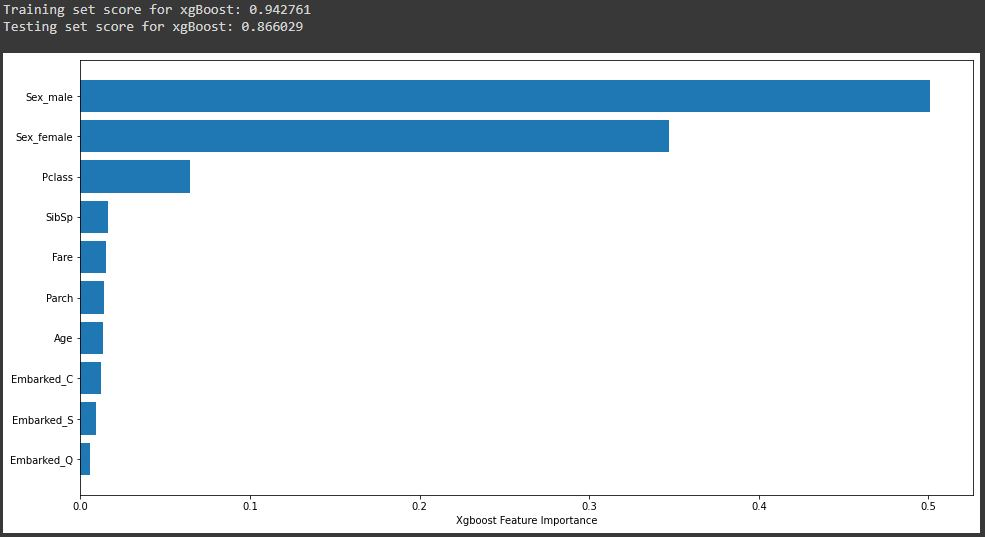
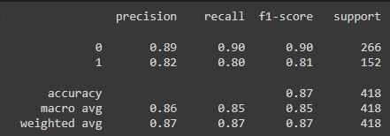
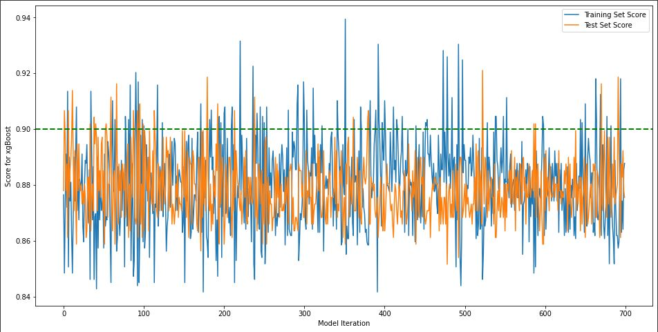

# Titanic-Dataset

## Introduction

The Titanic was a great and unexpected disaster in the early 1900’s. The “unsinkable” ship struck an iceberg causing fatal damage to the integrity of the ship.  This model is to accurately predict the survival of passengers aboard the ship the early morning of April 15th, 1912.

## Business Value

* Upskilling of entry level Data Scientists by tackling a binary classification problem which can then be used in real world applications.
* Encouragingcreative/”outsidethe box” thinking to feature engineer and improve model performance.

## Methodology

* Analysis of Titanic data to understand key features of surviving passengers.
* Binary classification using XGBoost.
* Feature engineering to improve model performance and accuracy.
* Bayesian Optimization of tuning parameters to target well fit models with high model scores.
 
 ## Feature Engineering
#### Newfeatures:
* Title of an individual
* Family Size
* Fare cost per Person
* Parent: Mother / Father
* Family Demographics
#### FeatureBin:
* Family Size
* Age

## Baseline Model
* Using XGBoost, create a baseline model to be able to compare the impact of the importance of feature engineering and it's impact on model performance.

### BASELINE MODEL RESULTS [Overfit]
* Training Score: 94.2%
* Test Score: 86.6%

### FeatureImportance:
* Gender: Sex_male / Sex_female

## Bayesian Optimation - Tuning Hyperparameters to reduce overfitting and target ideal model performance.

* A universe of hyperparameters for tuning is defined in this process and used for all subsiquent model tuning.  The universe of hyperparameters are as follows:

space={
* 'eta' : hp.quniform('eta', 0, .2, 0.001),
*       'gamma': hp.uniform ('gamma', 0, 1),
*       'max_depth': hp.quniform("max_depth", 5, 7, 1),
*       'min_child_weight' : hp.quniform('min_child_weight', 1, 2, 1),
*       'colsample_bytree' : hp.quniform('colsample_bytree', 0.9, 1, 0.05),
*       'reg_alpha' : hp.quniform('reg_alpha', 0, 5, 1),
*       'reg_lambda' : hp.uniform('reg_lambda', 1, 1.15),
*        'n_estimators': hp.quniform("n_estimators", 10, 150, 10),
*        'seed': 0
    }
    
An iterative approach, 700 iterations, is performed to target the ideal tuning parameters.  The following trends shows the models train/test accuracies vs iteration.

However, in order to reduce overfitting, a parameter is defined as the absolute value of the difference between training and test accuracies.  Plotting a criteria of this new parameter less than 0.005 yeilds the following trends:

## Feature Engineering Impact on Model Performance:
This process was repeated for each instance of feature engineering described above.  One may notice an overall increase in tuned model performance with an increased model evolution.

* Bin of Family Size: - 1.7% 
* Family Gender Count: + 2.1%

## SUMMARY: Best Model

### BEST MODEL RESULTS
* Training Score: 90.68%
* Test Score: 90.19%

### Feature Importance:
* Gender: name_title_Mr / Pclass_3
* Engineered features such as “name_title” and “family_size” ranked high in feature importance, yielding 50% of the top 10 important features.

## FUTURE CONSIDERATIONS
* IncreasecomplexityofBayesian optimization to expand the ”universe” of hyperparameters being tuned and their limits
* Automatingcolumnselectionto iterate all combinations of columns used and columns to one-hot encode
* UtilizingGPUpowertosupportmore advanced optimization practices

